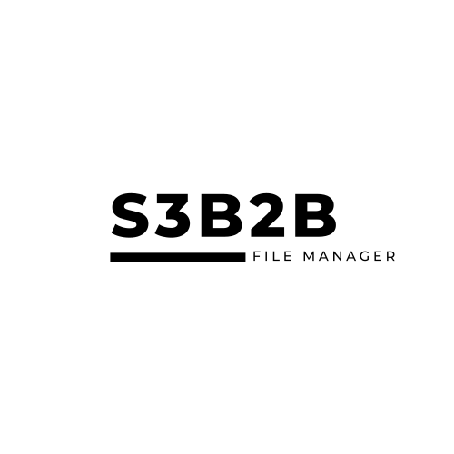
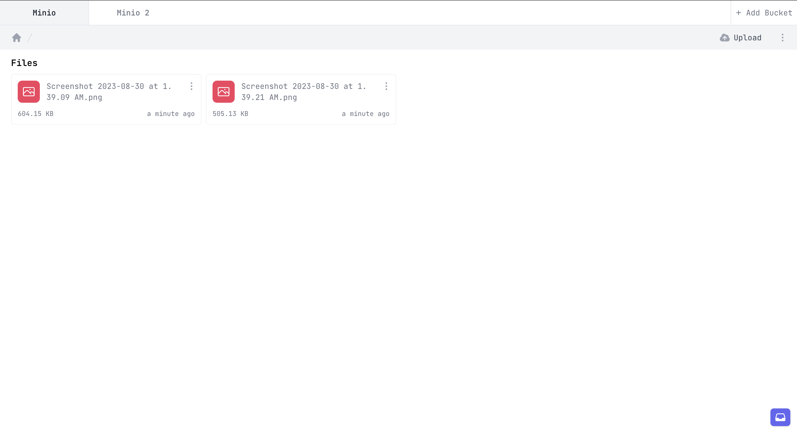
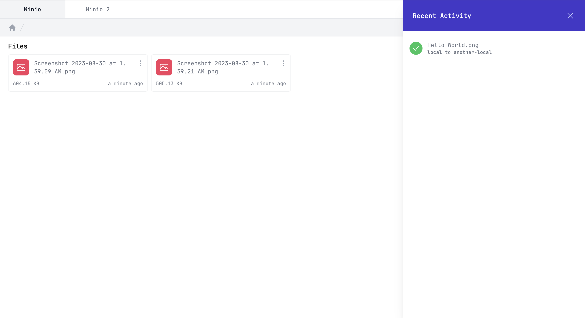
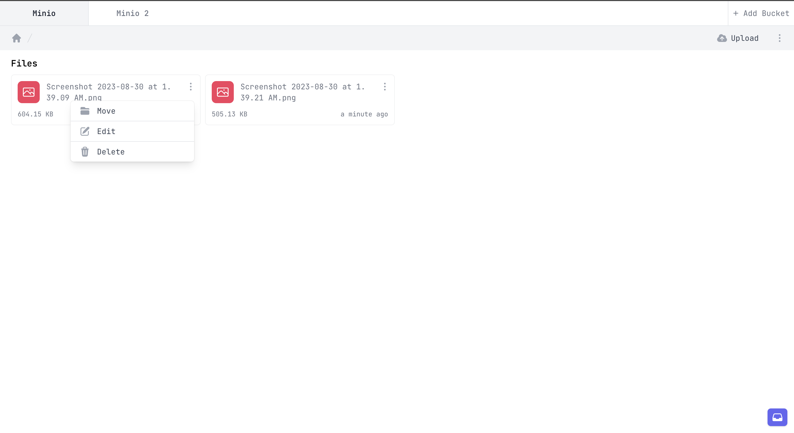
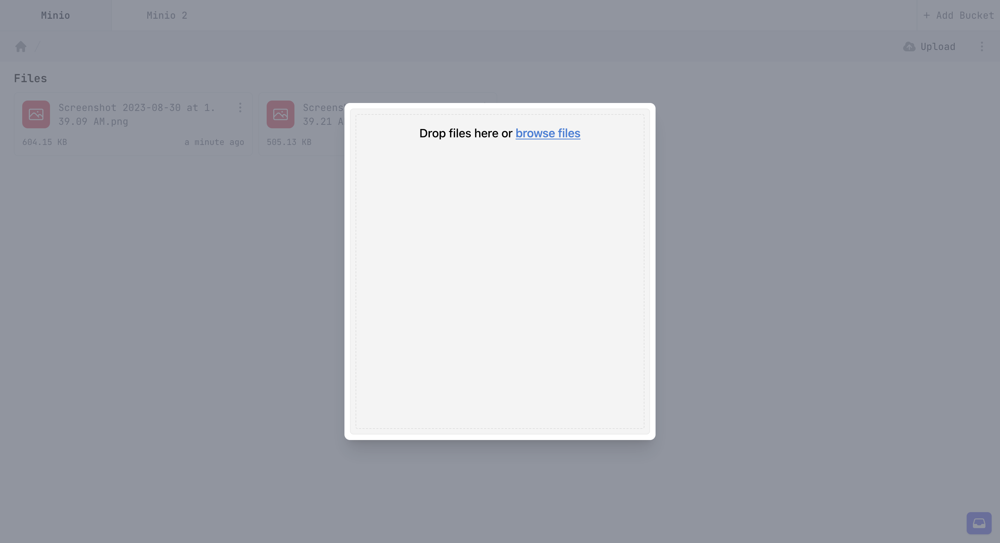
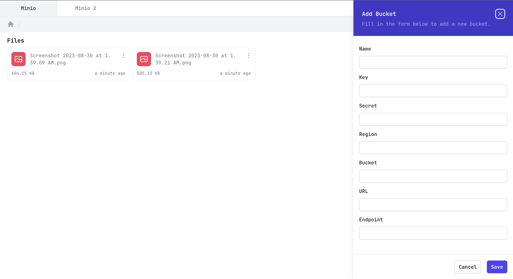
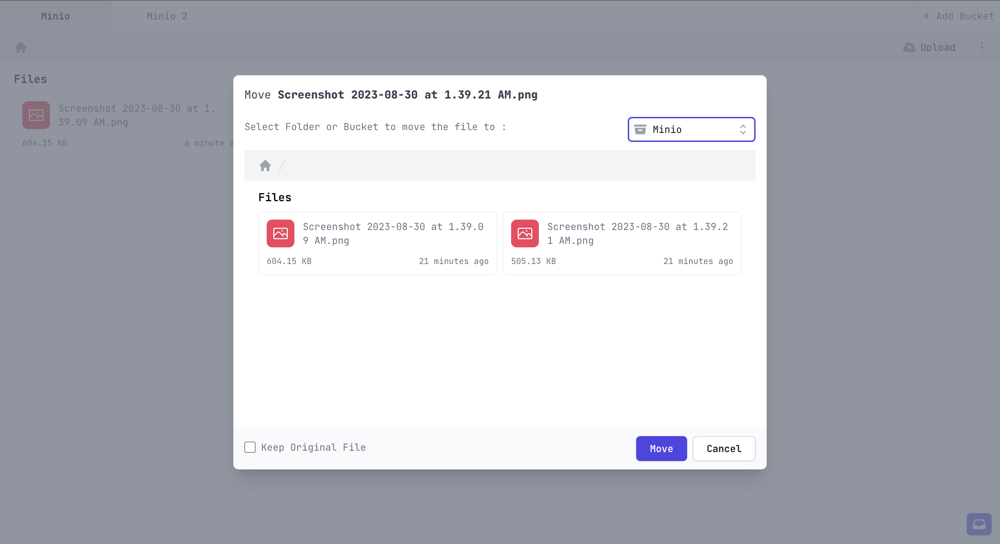

<p align="center">
<a href="#" target="_blank">

</a>
</p>


## S3B2B

S2B2B is a simple S3 file manager. It can manage multiple file storage at the same time and can also easily move files from one S3 bucket to another S3 bucket.

## Requirements

- PHP >= 8.1

## Installation

Before installing, make sure you have [Composer](https://getcomposer.org/) and [Yarn](https://yarnpkg.com/) installed.
And, you need to install [Soketi](https://docs.soketi.app/) to run the web socket server.

```bash
composer install
yarn install && yarn dev
cp .env.example .env

php artisan key:generate
php artisan migrate

soketi start
```
## Todo
- [ ] add new folder
- [ ] drag and move to folder

## Credits
- All Contributors

## License
The MIT License[MIT License](https://opensource.org/licenses/MIT). Please see License File for more information.

## Screenshots






